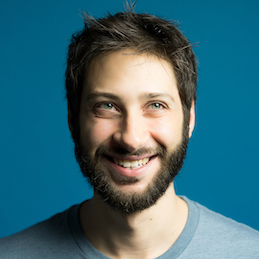

{:style="float: left;margin-right: 20px;margin-top: 7px;"}

Hi, my name is Leandro and I am the Head of Mobile Engineering at [hibooks](https://www.hibooks.com/). Previously, I led the Android team at [Blinkist](https://www.blinkist.com/).

I studied Electrical Engineering at Unicamp, [one of the best](https://www.topuniversities.com/university-rankings/brics-rankings/2014/) and [most prestigious](https://www.timeshighereducation.com/world-university-rankings/2018/latin-america-university-rankings/) university in Latin America. My programming experience started back at school helping organize workshops to program robots using [Pascal](https://en.wikipedia.org/wiki/Pascal_(programming_language)) after classes. This led me down a path of passion for coding that continues to this day. Understanding the whole software stack, from transistors to Assembly to Java helps me immensely.

At the moment, I am absorbing anything I can around [Kotlin](https://kotlinlang.org/). It’s the nicest programming language I had the pleasure to get to know.

I grew up in São Paulo and I currently live in Berlin. Berlin’s [message](http://www.paulgraham.com/cities.html) for me is: be creative. Build. I love building things. e.g. I am currently writing an app (iOS, Android and the backend) to manage my favorite quotes — in Kotlin. I also love to learn. This is why I worked for companies in the education industry.

My newest hobby is cooking plant-based meals. Maybe that’s also Berlin’s influence on me.

Let’s chat. You can reach me via [email](mailto:lfavarin+site@gmail.com?subject=Hi), find me on [GitHub](https://github.com/leandrofavarin/){:rel='me'}, [Mastodon](https://mastodon.social/@leandrofavarin){:rel='me'}, and [LinkedIn](https://www.linkedin.com/in/leandrofavarin/){:rel='me'}.
